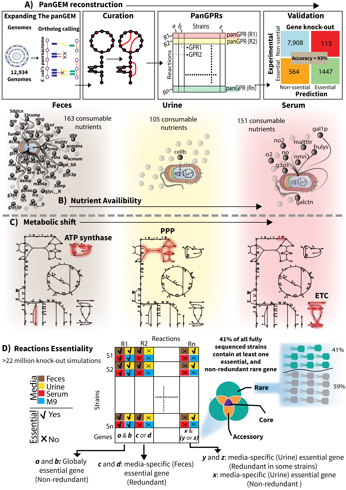

# E. coli Pangenome-Scale Metabolic Model Reconstruction and Analysis: “Pangenome-Scale Metabolic Network Reconstruction Reveals a Diverse Genetic Basis for Metabolic Reactions”

This repository contains data and code for the pangenome-scale metabolic reconstruction of *Escherichia coli*, enabling detailed analysis of its metabolic diversity. By analyzing gene–protein–reaction (GPR) associations across thousands of strains, this work quantifies the genetic basis of *E. coli* metabolism and the evolutionary dynamics shaping metabolic functions.

## Method Overview (Figures)

<table>
  <tr>
    <td width="50%">
      
      <p align="center"><em>pipeline overview for panGEM reconstruction and analysis.</em></p>
    </td>
    <td width="50%">
      
      <p align="center"><em>pangenome annotation and gene-based analyses.</em></p>
    </td>
  </tr>
</table>

## Overview

We constructed strain-specific genome-scale metabolic models (GEMs) for 2,377 complete *E. coli* genomes, covering ~2,700 reactions. The resulting pangenome-scale model (“panGEM”) links genotype to phenotype, supports gap-filling and targeted curation, and enables downstream analyses such as Biolog growth prediction, gene neighborhood mining, and GPR/allele mapping.

## Quick Start

1. **Create environment**

   ```bash
   conda env create -f environment.yml
   conda activate panGEM
   conda install -c bioconda blast   # provides makeblastdb, blastp, blastn
   ```
2. **Place data (from Zenodo)**

   * Core bundle: [https://zenodo.org/records/14028473](https://zenodo.org/records/14028473)
   * GEMs bundle: [https://zenodo.org/records/13825392](https://zenodo.org/records/13825392)
     Extract into `data/` keeping this layout:

   ```
   data/
   ├─ ref_model_dir/marlbr2.mat
   ├─ target_genome_dir/*.gbk
   ├─ prokka_genomes/*.gbk
   ├─ biolog_panGEM.csv
   ├─ iB21_1397.json
   ├─ merged_df.csv                 # if using curated-reaction addition
   ├─ neighbors/
   │  ├─ pa_gene_allt_copy2.pkl
   │  ├─ locustags_genes_mapping.pkl
   │  └─ pangenome_df.pkl
   └─ (other folders will be created by scripts)
   ```
3. **Run core pipeline**

   ```bash
   python scripts/pangem.py                # orthology → draft GEMs
   python scripts/ecoli_gapfilling6.py     # essential gap-filling (M9-like)
   python scripts/Eco_panGEM_curation.py   # targeted curation sweep
   python scripts/biolog_ecoli_prediction.py  # phenotype (Biolog/M9) prediction
   ```

   *Optional steps are listed below; paths inside scripts assume the layout above.*

## Repository Structure

* **data/**
  Input data and generated outputs (see layout above).
* **scripts/**
  Standalone steps for reconstruction, curation, and analyses:

  * `pangem.py` — reciprocal BLAST + nucleotide checks → presence/absence matrices; draft GEMs
  * `ecoli_gapfilling6.py` — add essential subset from reference under M9 conditions
  * `Eco_panGEM_curation.py` — targeted curation (ID changes, GPR merges, added reactions)
  * `biolog_ecoli_prediction.py` — FBA-based growth predictions on M9 + carbon sources
  * `gems_missing_genes.py` → `miss_locci_df_preparation.py` → `gems_missing_reactions_kegg.py` → `add_missed_reactions_ecoli.py` — optional track to find missing loci, map to KEGG/EC, and add curated reactions
  * `add_spont_to_gems_ecoli4.py` — add spontaneous (`s0001`) reactions (optional)
  * `eco_gems_allels.py` — reaction×GEM GPR/allele matrix export (optional)
  * `genes_neighborhood_analysis_total_preparation.py` (expand) + extractor (optional) — neighborhood mining
* **notebook/**
  Optional Jupyter material for exploration/figures.
* **docs/**
  Figures and documentation assets.

## Typical Outputs

* Draft models: `data/output_models_dir/`
* Gapfilled models: `data/gapfilled3/`
* Curated models: `data/gapfilled_curated/`
* Orthology/GPR tables: `data/present_absence_dir/`
* Biolog predictions: `data/biolog_data_with_predictions_panGEM_paper.csv`
* GPR/allele matrix: `data/ecoli_gprs.csv`
* Neighborhood results: `data/neighbors/`

## Requirements

* **Software:** Python ≥3.10, COBRApy, pandas, Biopython, tqdm, openpyxl, bioservices; BLAST+ on `PATH`
* **Hardware:** Scripts default to 64–96 processes in some steps; reduce pool sizes if RAM/CPU is constrained.

## Notes & Tips

* Some scripts historically used absolute paths (e.g., `/home/omidard/...`). The provided layout under `data/` mirrors those expectations; adjust paths inside scripts if you use a different structure.
* KEGG queries via `bioservices` can rate-limit; consider caching.
* File names ending with `.json` are expected by `Eco_panGEM_curation.py`.

## Citation

If you use this repository or derived models, please cite:
**“Pangenome-Scale Metabolic Network Reconstruction Reveals a Diverse Genetic Basis for Metabolic Reactions.”**
(Preprint/journal details here.)
Zenodo datasets: **14028473** (core) and **13825392** (GEMs).

## License

Add a `LICENSE` file (e.g., MIT/BSD-3-Clause).

## Contact

Omid Ardalani — [omidard@biosustain.dtu.dk](mailto:omidard@biosustain.dtu.dk) · Issues and PRs welcome.
