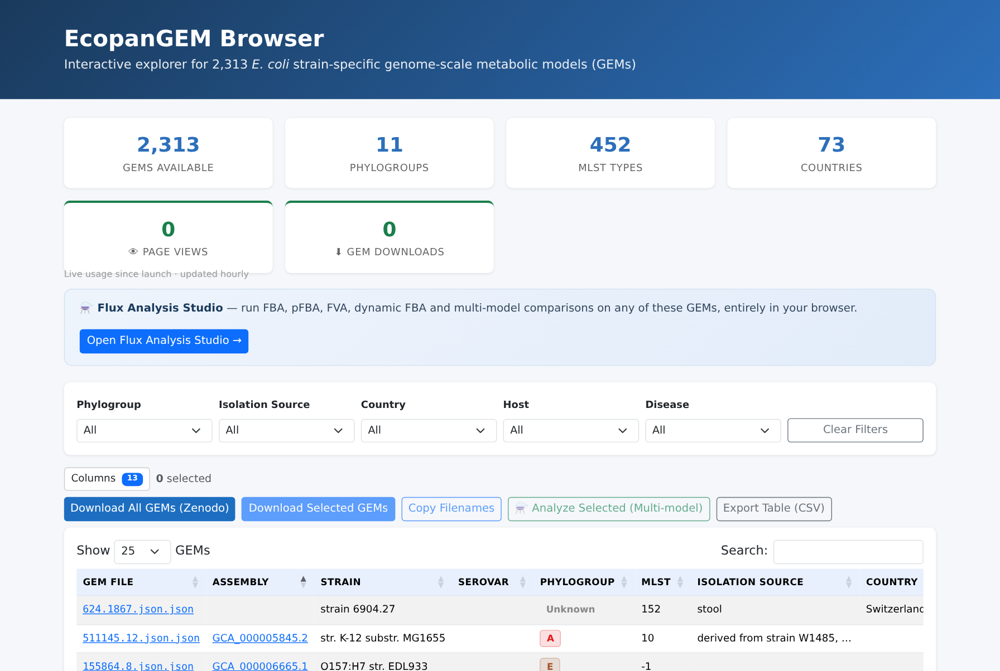
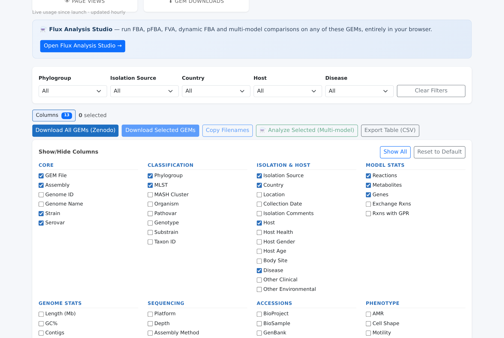
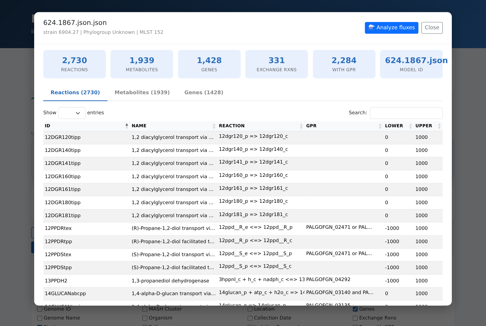
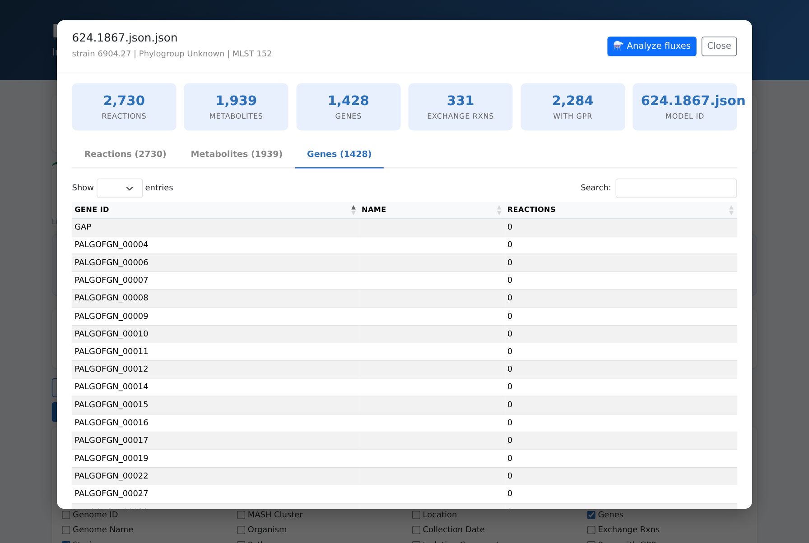
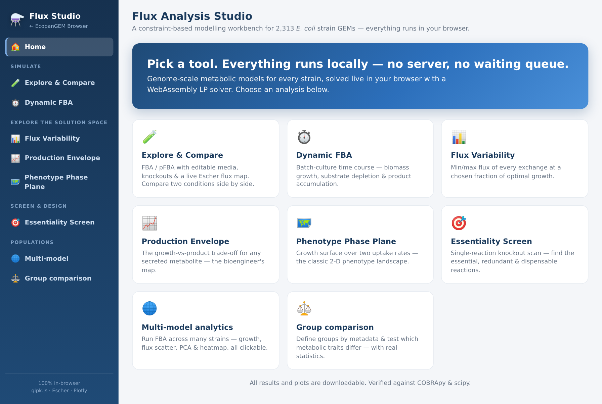
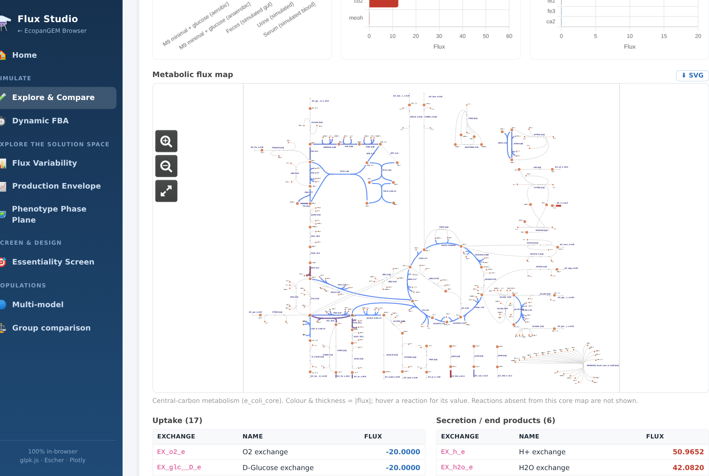
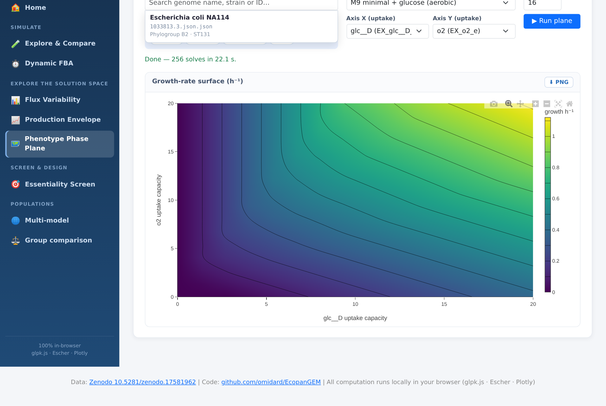
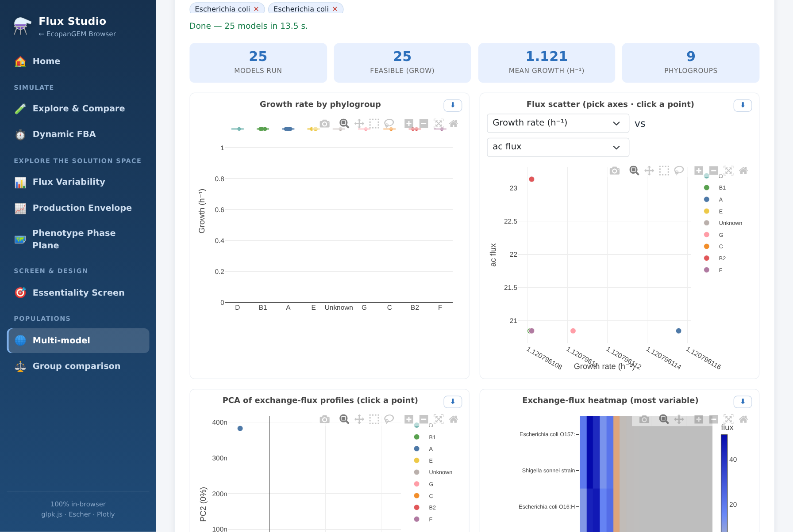
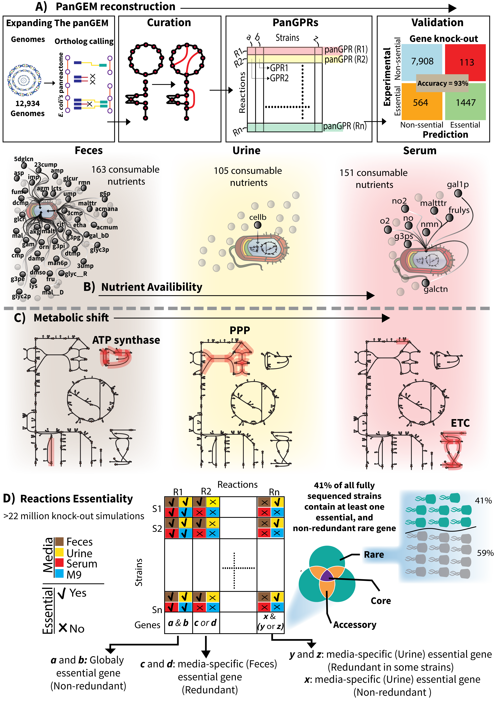

# E. coli Pangenome-Scale Metabolic Model Reconstruction and Analysis

**"Pangenome-Scale Metabolic Network Reconstruction Reveals a Diverse Genetic Basis for Metabolic Reactions."**

This repository contains data and code for the pangenome-scale metabolic reconstruction of *Escherichia coli*, enabling detailed analysis of its metabolic diversity. By analyzing gene-protein-reaction (GPR) associations across thousands of strains, this work quantifies the genetic basis of *E. coli* metabolism and the evolutionary dynamics shaping metabolic functions.

> **Data availability (Zenodo)**
> * Core bundle (scripts + supporting data + panGEM): https://zenodo.org/records/17581962

---

## Explore the models online

Two interactive web apps ship with this project — both run **entirely in your browser**: no install, no login, and nothing is ever sent to a server.

<!-- ─────────────────────────  EcopanGEM Browser  ───────────────────────── -->
### 🧬 EcopanGEM Browser

Browse, search and **filter all 2,313 strain-specific GEMs** by phylogroup, MLST, isolation source, country, host, disease and 54 metadata columns. Every model shows its reaction / metabolite / gene / exchange / GPR counts — **click any model to open it** and inspect its full reactions, metabolites and genes in searchable tables. Download any selection, or send a set straight to the analysis studio.

<table>
<tr>
<td width="50%"><a href="https://omidard.github.io/EcopanGEM/"></a></td>
<td width="50%"><a href="https://omidard.github.io/EcopanGEM/"></a></td>
</tr>
<tr>
<td width="50%"><a href="https://omidard.github.io/EcopanGEM/"></a></td>
<td width="50%"><a href="https://omidard.github.io/EcopanGEM/"></a></td>
</tr>
</table>

<p align="center">
  <em>Searchable table · 54 metadata columns · per-model reactions, metabolites &amp; genes</em><br><br>
  <a href="https://omidard.github.io/EcopanGEM/"></a>
  &nbsp;&nbsp;<a href="https://omidard.github.io/EcopanGEM/"><code>omidard.github.io/EcopanGEM</code></a>
</p>

<br>

<!-- ─────────────────────────  Flux Analysis Studio  ───────────────────────── -->
### ⚗️ Flux Analysis Studio

A full **constraint-based-modelling workbench** — the LP is solved **client-side** with a WebAssembly build of GLPK. Eight tools: FBA / pFBA with editable media &amp; knockouts, dynamic FBA, flux variability, production envelopes, phenotype phase planes, essentiality screens, multi-model analytics and metadata **group comparison** — each with a live **Escher** flux map or interactive Plotly charts, and every plot downloads as PNG / SVG.

<table>
<tr>
<td width="50%"><a href="https://omidard.github.io/EcopanGEM/analysis.html"></a></td>
<td width="50%"><a href="https://omidard.github.io/EcopanGEM/analysis.html"></a></td>
</tr>
<tr>
<td width="50%"><a href="https://omidard.github.io/EcopanGEM/analysis.html"></a></td>
<td width="50%"><a href="https://omidard.github.io/EcopanGEM/analysis.html"></a></td>
</tr>
</table>

<p align="center">
  <em>FBA · pFBA · FVA · dynamic FBA · production envelope · phase plane · essentiality · multi-model · group comparison</em><br><br>
  <a href="https://omidard.github.io/EcopanGEM/analysis.html"></a>
  &nbsp;&nbsp;<a href="https://omidard.github.io/EcopanGEM/analysis.html"><code>omidard.github.io/EcopanGEM/analysis.html</code></a>
</p>

<details>
<summary><b>What's inside the Flux Analysis Studio</b> (click to expand)</summary>

<br>

- **Explore & Compare** — FBA / parsimonious FBA, with editable media (per-compound uptake rates, add/remove compounds), reaction knockouts, a live **Escher** flux map, and an A-vs-B comparison mode.
- **Dynamic FBA** — batch-culture time-course (biomass, substrate depletion, product accumulation) with Michaelis–Menten uptake.
- **Flux Variability Analysis (FVA)** — min/max flux of every exchange at a chosen fraction of optimal growth.
- **Production Envelope** — the biomass-vs-product trade-off frontier for any secreted metabolite (strain-design map).
- **Phenotype Phase Plane** — the growth surface over two uptake capacities, as a contour landscape.
- **Essentiality Screen** — single-reaction knockout scan classifying every reaction (essential / severe / mild / dispensable).
- **Multi-model analytics** — run FBA across many strains → growth by phylogroup, an interactive flux **scatter**, a **PCA** of exchange-flux profiles, and a heatmap (all clickable, Plotly).
- **Group comparison** — define two groups by metadata (phylogroup, MLST, pathotype, isolation source, host…) and test which metabolic traits differ, with Mann–Whitney U + Benjamini–Hochberg FDR and a differential-flux volcano plot.

Media presets: M9 ± O₂ and the HMDB-derived **Feces / Urine / Serum** formulations from S3–S5 Tables of Ardalani *et al.* (PLOS Pathogens `ppat.1013775`). All results — growth rates, pFBA sums, knockouts, FVA/envelope/phase-plane values and the cohort statistics — reproduce COBRApy / scipy to full precision.
</details>


---

**Update:** The *E. coli* panGEM is now also available on the BiGGr database:
https://biggr.org/collections/Ecoli_panGEMs/

---

## Method Overview (Figures)

<table>
  <tr>
    <td width="50%">
      
      <p align="center"><em>Rare Metabolic Gene Essentiality is a Determinant of Microniche Adaptation in
Escherichia coli [https://doi.org/10.1371/journal.ppat.1013775].</em></p>
    </td>
    <td width="50%">
      
      <p align="center"><em>Annotating the Pangenome Reveals the Diversity in the Genetic Basis for Metabolic Enzymes [https://www.science.org/doi/10.1126/sciadv.aeb3363].</em></p>
    </td>
  </tr>
</table>

---

## Overview

We constructed strain-specific genome-scale metabolic models (GEMs) for **2,377 complete *E. coli* genomes**, covering ~2,700 reactions. The resulting pangenome-scale model ("panGEM") links genotype to phenotype, supports gap-filling and targeted curation, and enables downstream analyses such as Biolog growth prediction, gene-neighborhood mining, and GPR/allele mapping.

---

## Quick Start

### 1) Create environment

```bash
# Clone
git clone https://github.com/omidard/EcopanGEM.git
cd EcopanGEM

# Conda env (option A: conda)
conda env create -f scripts/environment.yml
conda activate panGEM

# Conda env (option B: mamba — much faster solver, recommended if conda is slow)
conda install -n base -c conda-forge mamba
mamba env create -f scripts/environment.yml
conda activate panGEM

# External binaries (required)
conda install -c bioconda blast cd-hit   # provides makeblastdb/blastp/blastn + cd-hit
```

### 2) Download data from Zenodo

The Zenodo record contains 15 individual files (~5.4 GB total). The `data/Makefile` downloads all files, unzips archives, and organizes them into the directory structure expected by the scripts:

```bash
cd data && make fetch-data
```

This creates the following layout inside `data/`:

```
data/
├── ref_model_dir/
│   └── marlbr2.mat                        # Reference model (Entrobacteriaceae)
├── gapfilled_curated/
│   └── *.json.json                         # Curated GEMs (from Ecoli_GEMs_for_Complete_genomes.zip)
├── neighbors/
│   ├── locustags_genes_mapping.pkl         # Locus-tag to gene-name mapping (2.4 GB)
│   └── all_reactions_gene_neighborhood.csv # Pre-computed gene neighborhood results
├── pangenome_s/
│   ├── cluster_to_locus_*.json             # Cluster-to-locus maps per CD-HIT threshold
│   └── presence_absence_matrix_*.csv       # Presence/absence matrices per threshold
├── biolog.csv                              # Biolog phenotype data (original name)
├── biolog_panGEM.csv                       # Same file, renamed to match scripts
├── universal_model.json                    # Universal model (original name)
├── iB21_1397.json                          # Same file, renamed to match scripts
├── header_to_allele.pickle                 # Header-to-allele mapping
├── ecoli_gprs.csv                          # GPR matrix (reaction x GEM)
├── phylon_locustags_df.csv                 # Phylon locus-tag dataframe
├── pangenome.csv                           # Pangenome presence/absence
├── curated_metadata_mash_filtered.pickle   # Curated metadata
└── Unique_ModelSEED_Reaction_Aliases.txt   # ModelSEED reaction aliases
```

#### Zenodo file-to-script mapping

| Zenodo file | Placed at | Used by |
|-------------|-----------|---------|
| `marlbr2.mat` | `ref_model_dir/marlbr2.mat` | `pangem.py`, `ecoli_gapfilling6.py`, `add_spont_to_gems_ecoli4.py` |
| `Ecoli_GEMs_for_Complete_genomes.zip` | `gapfilled_curated/*.json.json` | `biolog_ecoli_prediction.py`, essentiality scripts |
| `biolog.csv` | `biolog_panGEM.csv` | `biolog_ecoli_prediction.py` |
| `universal_model.json` | `iB21_1397.json` | `Eco_panGEM_curation.py` |
| `locustags_genes_mapping.pkl` | `neighbors/locustags_genes_mapping.pkl` | `genes_neighborhood_analysis_total_preparation.py` |
| `header_to_allele.pickle.zip` | `header_to_allele.pickle` | `eco_gems_allels.py` |
| `ecoli_gprs.csv.zip` | `ecoli_gprs.csv` | Pre-computed output (GPR/allele matrix) |
| `pangenome.csv.zip` | `pangenome.csv` | Pangenome analysis |
| `pangenome_s.zip` | `pangenome_s/` | `pangenome_sensitivity_results.py` |
| `all_reactions_gene_neighborhood.csv.zip` | `neighbors/all_reactions_gene_neighborhood.csv` | Pre-computed neighborhood output |
| `phylon_locustags_df.csv.zip` | `phylon_locustags_df.csv` | Phylon analysis |
| `curated_metadata_mash_filtered.pickle` | `curated_metadata_mash_filtered.pickle` | Metadata filtering |
| `Unique_ModelSEED_Reaction_Aliases.txt` | `Unique_ModelSEED_Reaction_Aliases.txt` | Reaction alias lookups |

#### Files NOT on Zenodo (produced by the pipeline or obtained from NCBI)

| Path | How to obtain |
|------|---------------|
| `data/target_genome_dir/*.gbk` | Download complete *E. coli* genomes from NCBI Assembly |
| `data/prokka_genomes/*.gbk` | Re-annotate genomes with Prokka (or use GBK from NCBI) |
| `data/output_models_dir/` | Produced by `pangem.py` (Step C1) |
| `data/gapfilled/` | Produced by `add_spont_to_gems_ecoli4.py` (Step C4) |
| `data/gapfilled3/` | Produced by `ecoli_gapfilling6.py` (Step C2) |
| `data/merged_df.csv` | Produced by the missing-reactions sub-pipeline (Step C6) |
| `data/fitness_rare.csv` | Produced by essentiality analysis |

#### Overriding the data directory

All scripts resolve `data/` relative to their own location. To use a different data directory, set the `ECOPANGEM_DATA` environment variable:

```bash
export ECOPANGEM_DATA=/path/to/your/data
python scripts/ecoli_gapfilling6.py
```

---

## End-to-End Pipeline (required order)

> **Important:** The QC/QA + pangenome steps must be run **before** notebooks and downstream analyses.

### A) Genome QC & Filtering

1. **QC & (optionally) CheckM2**

   ```bash
   python scripts/genome_qc.py \
     --base_dir data/target_genome_dir \
     --out data/qc/genome_qc_results.csv \
     --threads 32 \
     --runner micromamba \
     --env ckm2 \
     --checkm2_db /path/to/checkm2_db    # omit to skip CheckM2
   ```

2. **Filter genomes (dry-run -> apply)**

   ```bash
   # dry-run (prints reasons; no changes)
   python scripts/genome_qc_filtering.py \
     --qc data/qc/genome_qc_results.csv \
     --base data/target_genome_dir \
     --out-table data/qc/genome_qc_results_annotated.csv

   # apply (moves failing genomes to quarantine)
   python scripts/genome_qc_filtering.py \
     --qc data/qc/genome_qc_results.csv \
     --base data/target_genome_dir \
     --apply \
     --quarantine data/target_genome_dir/quarantine_low_quality
   ```

*(A convenience wrapper exists at `scripts/genome_qc.sh`.)*

---

### B) Pangenome Generation (multi-threshold CD-HIT)

```bash
python scripts/pangenome_sensitivity_gbk.py
# Interactive prompts will ask for:
# - BASE dir (for logs/outputs), ANNOTATIONS dir, PANGENOME dir
# - cd-hit path (e.g., cd-hit if on PATH), threads (e.g., 32)
# - thresholds: 65,70,75,80,85,90,95  (Enter for 80)
# - -aL coverage for longer sequence (e.g., 80)
```

**Outputs (per X):**
`pangenome/cdhit_full_X.faa`, `pangenome/cdhit_full_X.faa.clstr`,
`pangenome/presence_absence_matrix_X.csv`, `pangenome/cluster_to_locus_X.json`.

**Sensitivity figures/tables**

```bash
python scripts/pangenome_sensitivity_results.py
# reads the above outputs from data/pangenome_s/ and produces:
# figures/clusters_vs_cdhit_threshold.(png|svg)
# figures/CAR_*_cdhit80.(png|svg)  + CSV tables
```

---

### C) GEM Drafting -> Gap-filling -> Curation -> Phenotype

1. **Orthology -> draft GEMs**

   ```bash
   python scripts/pangem.py
   ```
   *Outputs: `output_models_dir/`, `initial_models_dir/`, `present_absence_dir/`*

2. **Essential gap-filling (M9-like)**

   ```bash
   python scripts/ecoli_gapfilling6.py
   ```
   *Reads: `output_models_dir/`, `ref_model_dir/marlbr2.mat`. Writes: `gapfilled3/`*

3. **Add spontaneous reactions (`s0001`)**

   ```bash
   python scripts/add_spont_to_gems_ecoli4.py
   ```
   *Reads/writes: `gapfilled3/`*

4. **Curation sweep (IDs, bounds, GPR merges, add/remove reactions)**

   ```bash
   python scripts/Eco_panGEM_curation.py
   ```
   *Reads: `gapfilled3/`, `iB21_1397.json`. Writes: `gapfilled_curated/`*

5. **Biolog phenotype prediction (M9 + carbon sources)**

   ```bash
   python scripts/biolog_ecoli_prediction.py
   ```
   *Reads: `gapfilled_curated/`, `biolog_panGEM.csv`. Writes: `biolog_data_with_predictions_panGEM_paper.csv`*

6. **Missing genes -> KEGG/EC -> add curated reactions (parallel)**

   ```bash
   python scripts/gems_missing_genes.py
   python scripts/miss_locci_df_preparation.py
   python scripts/gems_missing_reactions_kegg.py
   python scripts/add_missed_reactions_ecoli.py
   ```
   *Reads: `prokka_genomes/`, `output_models_dir/`. Writes: intermediate CSVs, then updates `gapfilled3/`*

7. **Allele/GPR export (reaction x GEM)**

   ```bash
   python scripts/eco_gems_allels.py
   ```
   *Reads: `gapfilled3/`, `header_to_allele.pickle`. Writes: `ecoli_gprs.csv`*

8. **Gene-neighborhood mining (GBK parsing; multiprocessing)**

   ```bash
   python scripts/genes_neighborhood_analysis_total_preparation.py
   python scripts/genes_neighborhood_analysis_total2.py
   ```
   *Reads: `neighbors/*.pkl`, `prokka_genomes/`. Writes: `neighbors/final_gene_neighborhood.csv`, `neighbors/all_reactions_gene_neighborhood.csv`*

---

## Outputs (where to find things)

* Draft models: `data/output_models_dir/`
* Gapfilled models: `data/gapfilled3/`
* Curated models: `data/gapfilled_curated/`
* Orthology/GPR tables: `data/present_absence_dir/`
* Biolog predictions: `data/biolog_data_with_predictions_panGEM_paper.csv`
* GPR/allele matrix: `data/ecoli_gprs.csv`
* Neighborhood results: `data/neighbors/`

---

## Scripts (what each does)

* `genome_qc.py` -- GBFF/GenBank-aware QC; writes FASTA, contig/N50/GC stats; optional **CheckM2** completeness/contamination.
* `genome_qc_filtering.py` -- robust filtering (hard guards + median/MAD) with dry-run/apply (quarantine or delete).
* `genome_qc.sh` -- wrapper to run QC + CheckM2 with consistent args.
* `pangenome_sensitivity_gbk.py` -- merges proteins (prefers GBK), runs **CD-HIT** at one/many identities, writes `cdhit_full_*.faa`, `*.clstr`, presence/absence matrices, and cluster->locus maps.
* `pangenome_sensitivity_results.py` -- generates publication-ready figures and CSVs for cluster counts vs threshold and CAR sensitivity (@80%).
* `pangem.py` -- reciprocal BLAST + nucleotide checks -> presence/absence -> **draft GEMs**.
* `ecoli_gapfilling6.py` -- adds only **essential** missing reactions from reference under M9 conditions.
* `Eco_panGEM_curation.py` -- targeted curation: ID changes, bounds, GPR merges, add/remove reactions per instruction map.
* `add_spont_to_gems_ecoli4.py` -- adds spontaneous (`s0001`) reactions.
* `biolog_ecoli_prediction.py` -- FBA growth predictions on M9 with specified carbon sources; appends to Biolog table.
* `gems_missing_genes.py -> miss_locci_df_preparation.py -> gems_missing_reactions_kegg.py -> add_missed_reactions_ecoli.py` -- detects genes present in genomes but absent from GEMs; maps to KEGG/EC; fetches reaction metadata/PMIDs; adds curated reactions/GPRs in parallel.
* `eco_gems_allels.py` -- exports reaction x GEM allele/GPR matrix.
* `genes_neighborhood_analysis_total_preparation.py` -- builds reaction-specific gene-neighborhood tables (multiprocessing; GBK parsing).
* `genes_neighborhood_analysis_total2.py` -- alternate/legacy neighborhood expansion/extraction.

---

## Environment & Requirements

* **Python:** >= 3.10
* **Packages:** see `environment.yml` in this repo (COBRApy, pandas, numpy, scipy, tqdm, Biopython, bioservices, matplotlib, rich, requests, joblib, scikit-learn, openpyxl, pyyaml, python-dotenv, etc.).
* **External binaries:** **BLAST+** (`makeblastdb`, `blastp`, `blastn`) and **CD-HIT** must be on `PATH`.
* **Hardware:** Several steps default to high parallelism (64-96 workers). Reduce pool sizes if RAM/CPU is constrained.

---

## Notes & Tips

* KEGG queries via `bioservices` may rate-limit; consider chunking or local caching.
* Some curation code expects `.json` model files and specific IDs/bounds (kept consistent across steps here).

---

## Citation

If you use this repository or derived models, please cite:

> **"Annotating the Pangenome Reveals the Diversity in the Genetic Basis for Metabolic Enzymes"**

---

## Contact

**Omid Ardalani** -- [omidard@biosustain.dtu.dk](mailto:omidard@biosustain.dtu.dk) -- Issues and PRs welcome.

---
